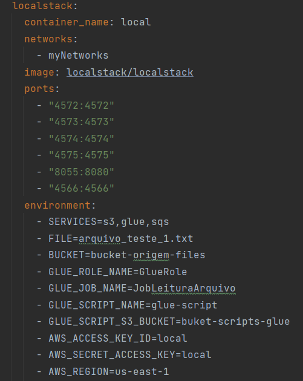
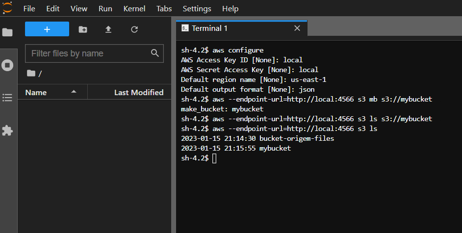

# localstack

### Comandos Básicos S3

- Criar Bucket S3
  ``aws --endpoint-url=http://localhost:4566 s3 mb s3://mybucket``
- Listar bucket S3
  ``aws --endpoint-url=http://localhost:4566 s3 ls s3://mybucket``

### Ponto de atenção: comunicação entre containers

- Para acessar os recurso criado no container localstack através do jupter devemos seguir alguns passos
  - configurar aws credentials
  - ``aws configure``
  - Preencher os seguintes campos
  - ``AWS Access Key ID: local``
  - ``AWS Secret Access Key: local``
  - ``Default region name: us-east-1``
  - ``Default output format: json``
  
##### Essas cofigurações deve seguir a mesmas adicionadas no docker compose, conforme imagem abaixo:

  - no terminal do jupter digitar os seguintes comandos conforme o nome do container:
  - ``aws --endpoint-url=http://local:4566 s3 mb s3://mybucket``
  - o seguinte comando vai listar os bucket
  - ``aws --endpoint-url=http://local:4566 s3 ls s3://mybucket``

#### A imagem seguinte demostra como deve ser a resposta


#### Para testar utilizando o jupyter é só utilizar o código abaixo:
```python: import boto3
import boto3
import pandas as pd
import io

s3 = boto3.client('s3', endpoint_url='http://local:4566', aws_access_key_id='local', aws_secret_access_key='local')
sep = "_;"
try:
    obj = s3.get_object(Bucket='bucket-origem-files', Key='arquivo_teste_1.txt')
    byte_stream = io.BytesIO(obj['Body'].read())
    df = pd.read_csv(byte_stream, sep=sep, header=None)
    print(df.head())
except s3.exceptions.NoSuchKey:
    print("Arquivo não existe") 
  
